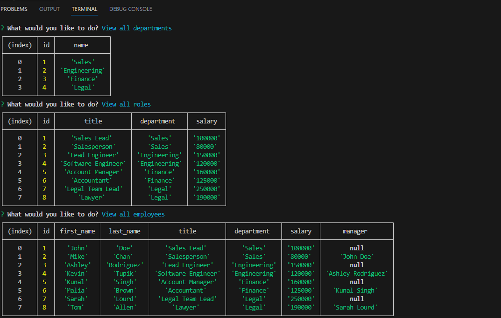

# Employee Tracker
 

## Description
This project is geneterated to build a command-line application to manage a company's employee database, using Node.js, Inquirer, and MySQL.

## Installation
1. Clone this repository to your local machine
2. Navigate to the repository's root directory
3. Install the required dependencies by running: npm install inquirer.
4. Install the required dependencies by running: npm install mysql2.


## Usage
1. Open your terminal.
2. Navigate to the repository's root directory.
3. Start the server with the following command: ```npm run start```
4. Follow the prompts to enter information.

## License
This project is licensed under the MIT license - see the [MIT License](https://opensource.org/licenses/MIT) file for details.

## Screenshot


## Video link
[https://watch.screencastify.com/v/KGvarhzebSOD8blTgFAQ](https://watch.screencastify.com/v/KGvarhzebSOD8blTgFAQ)